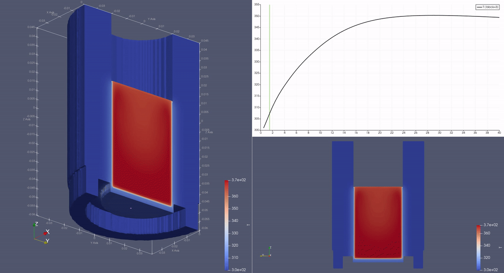

# Heat transfer analysis (CFD)

This repository contains three examples simulating a real-life manual lever espresso machine using OpenFoam CFD suite.

## Findings

After pouring 83ml of 100°c / 373 kelvin water into the machine, temperature starts rising quickly and plateaus at 26 second mark.

Depending on how hot you want your shower to be, before pulling a shot of espresso, you have to pour hot water again (while the less-hotter one drips away). This simplified simulation shows what happens if there's no stream, but fresh hot water is swapped with the dormant one:

Safe to say, you can re-pour in 80 second intervals, but the temperature gains start to subside past the 6th pour.

For future:
 - get the dripping version to work
 - add dynamic mesh of water

## Models

Some folders are missing model data due to the upload size. They are located inside `0/polyMesh` and `constant/*/polyMesh` folders. You cna regenerate them using blender and snappyHexMesh plugin.

For gmsh models, make sure to export them to `.msh` extension using `Version 2 ASCII` and then `gmshToFoam`.

## Scripts

Most of the work was done by me manually tinkering the files. Scripts may not work.
